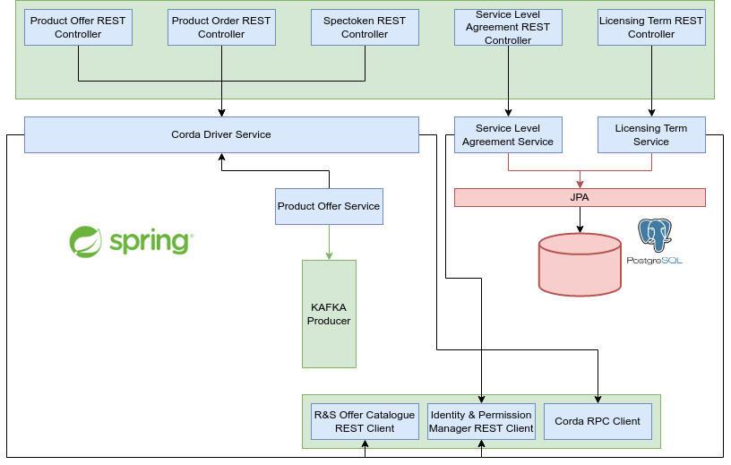

# Smart Contract Lifecycle Manager

## Introduction
The Smart Contract Lifecycle Manager is the component of the 5GZORRO Marketplace that manages the interactions and 
events between the service layer of the 5GZORRO platform and the Marketplace DLT, acting as a gateway, 
using ledger-centric drivers to map abstract interfaces to DLT specific functionalities: this enables the module to 
meet the needs of broader business-centric workflows, whilst remain agnostic to the DLC implementation, key objective 
of the 5GZORRO architecture.

The project encapsulates the Smart Contract Lifecycle Manager module of the 5GZORRO platform.
It is a SpringBoot application with associated documentation built from Swagger annotations. 

The DLT agnostic driver interface is described in the `dlt-driver-api` module, and the corda 
implementation of the marketplace smart contracts is contained under `corda-driver`. With the 
driver implementation at: `corda-driver/driver-impl`



## Prerequisites

### System Requirements
- 1 vCPU
- 2GB RAM

### Software dependencies
- PostgreSQL </br>
  ```bash
  docker run --name some-postgres -p 5432:5432 -e POSTGRES_PASSWORD=postgres -d postgres
  ```
- Apache Kafka </br>
  [Deploy Kafka on docker](https://www.baeldung.com/ops/kafka-docker-setup)
  
- Java 8 </br>
  ```bash
  sudo apt update
  sudo apt install openjdk-8-jdk
  ```

### 5GZORRO Module dependencies
- [Identity and Permission Manager](https://github.com/5GZORRO/identity)

## Installation
Both the installation procedures reported below require the creation of the required databases in the running
postgres instance. Run the following commands in order to create them:
```bash
docker exec -it <postgres_docker_id> /bin/bash
su postgres
createdb operator_a_sclm;
createdb operator_b_sclm;
createdb operator_c_sclm;
createdb regulator_a_sclm;
```

### Local Machine
#### Running Corda nodes locally
To package and run nodes locally run `./gradlew clean deployNodes` from the root directory
then navigate to `corda-driver/build/nodes` and run `./runnodes` on Mac/Linux or `runnodes.bat` on
Windows. This broadly follows the steps 
outlined [here](https://docs.corda.net/docs/corda-os/4.6/generating-a-node.html).

Nodes are configured (for example what nodes to deploy, cordApps included and config properties)
at `corda-driver/build.gradle` under the deployNodes task.

#### Deploy the application
To run the application using Gradle simply execute the following from the command-line:
```bash
./gradlew bootRun
```

You'll have to run an SCLCM Spring application for each Corda Node deployed with the previous instructions.

### Helm
The following instructions consider the Corda Nodes already deployed in Kubernetes environments through
the usage of the [Blockchain Automation Framework](https://github.com/5GZORRO/blockchain-automation-framework-4.7)
(e.g.,) as well as the previously listed dependencies.
Run the below helm command to deploy the SCLCM application for a given operator.
```bash
helm install smart-contract-lifecycle-manager-api ./deployment/                 
    --namespace operatora-ns --values ./deployment/values.yaml             
    --set hostname=172.28.3.6:31080/smart-contract-lifecycle-manager             
    --set dockerTag=5gzorro-core-1.23-rc             
    --set postgres.username=postgres             
    --set postgres.password=postgres             
    --set postgres.name=operator_a_sclm            
    --set identityBaseUrl="http://172.28.3.153:6200"         
    --set callbacks.updateSlaIdentity="http://172.28.3.6:31080/smart-contract-lifecycle-manager/api/v1/service-level-agreement/%s/identity"            
    --set callbacks.updateAgreementIdentity="http://172.28.3.6:31080/smart-contract-lifecycle-manager/api/v1/agreement/%s/identity"             
    --set corda.username=operatoraoperations             
    --set corda.password=usera             
    --set corda.host=operatora.operatora-ns.svc.cluster.local             
    --set operatorName=opa
```

You'll have to run an SCLCM Spring application for each Corda Node deployed with the previous instructions changing 
the `values.yaml` file, and the variables of the helm command accordingly. 

## Configuration
No particular configurations are needed.

## Maintainers
**Pietro Giuseppe Giardina** - *Design* - p.giardina@nextworks.it </br>
**Adriana Fernandez** - *Design* - adriana.fernandez@i2cat.net </br>
**Michael De Angelis** - *Develop and Design* - m.deangelis@nextworks.it </br>
**Daniel Bautista Miralles** - *Design and Develop* - daniel.bautista@i2cat.net

## License
This module is distributed under [Apache 2.0 License](LICENSE) terms.